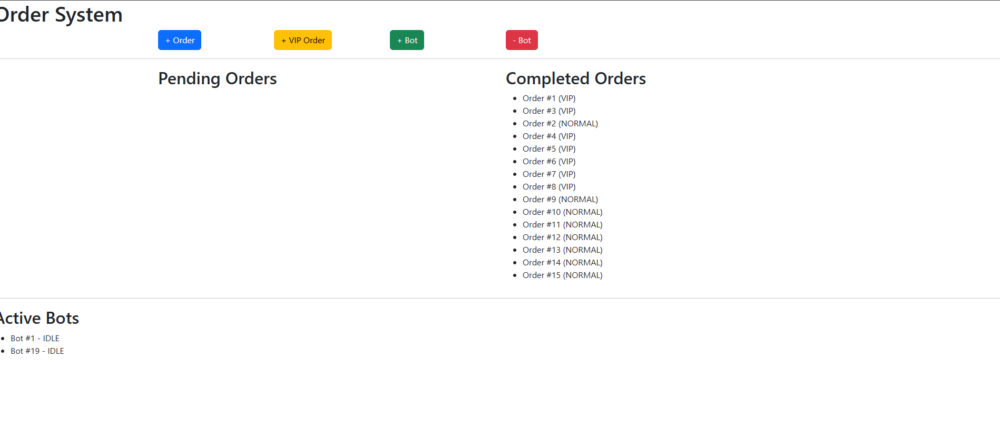

# Take Home Assignment Guide

> [!NOTE]
> This project is monorepo worked on Visual Studio Code consisting of `Reactjs` and `Nodejs + ExpressJs` and is meant to be presented using UI Application

> [!TIP]
> You might need 2 terminals to run this project.

## Setup

### Nodejs

You may check your Node.js existance by running the command on your terminal/CMD

> node -v

then

> npm -v

> [!TIP]
> If you haven't so, you may head to [their official website](https://nodejs.org/en/download/)

Navigate to folders `backend` and `frontend` (you may use 1 terminal each), run the following at both

> npm install

### Starting the project

Once you have the [setup](#setup) done, at both terminal locating at `backend` and `frontend` folder, run the following

> npm run start

At `frontend`, you should see the lines similar to:
<br/>

```
Compiled successfully!
You can now view frontend in the browser.
  Local:            http://localhost:3000
  On Your Network:  http://10.10.10.22:3000
Note that the development build is not optimized.
To create a production build, use npm run build.
```

While at `backend`, you should see lines similar to:

```
> backend@1.0.0 start
> nodemon app.js
[nodemon] 3.1.9
[nodemon] to restart at any time, enter `rs`
[nodemon] watching path(s): *.*
[nodemon] watching extensions: js,mjs,cjs,json
[nodemon] starting `node app.js`
Server is running on http://localhost:5000
```

Once you see both messages above, that means the project is successfully running.
You may navigate to browser of your choice and go to http://localhost:3000.
You should see the interface like below


There we can start operating with the website.

## Points

> [!WARNING]
> No persistent Data is used in this project, once the backend restarts, all progress will be lost.

In the project, as it is a combination of front and backend, according to the requirement of [assignment question](ASSIGNMENT-QUESTION.md#user-story), the bots can only pickup and process an order a time and the order should be processed finished in 10 seconds if no reduction of bot involves that bot. To fetch the data periodically, `setInterval` is been used along with function to fetch data time over time.

Whilst in backend, for bot to process order in 10 seconds, it is considered conditional timeout, hence `setTimeout` is been used as in certain conditions, the bot does not need to process further order or to terminate current process.

This project also takes measure of deleted bot that has a currently processing order, the result would be the bot be removed whilst processing order will return to pending orders, but located priortized of it's kind.
